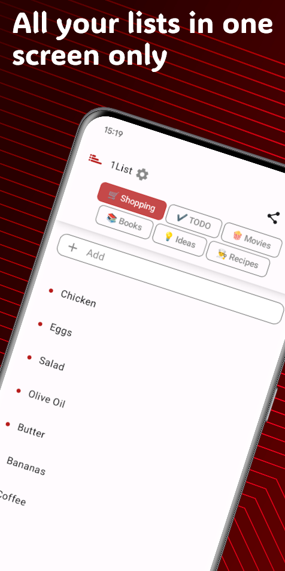
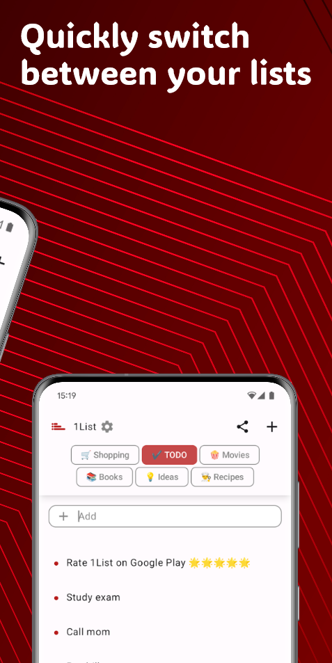
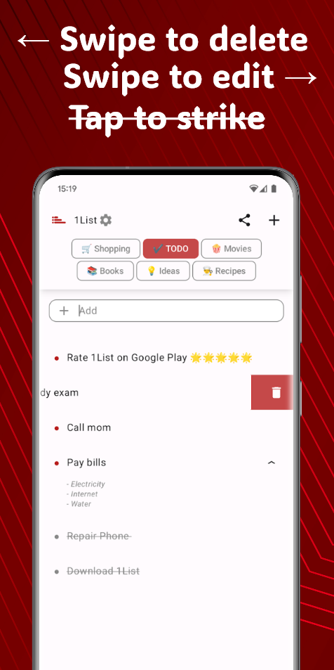
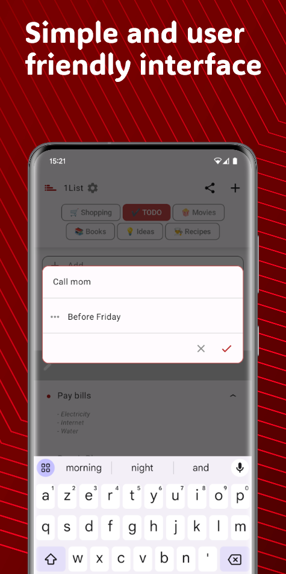
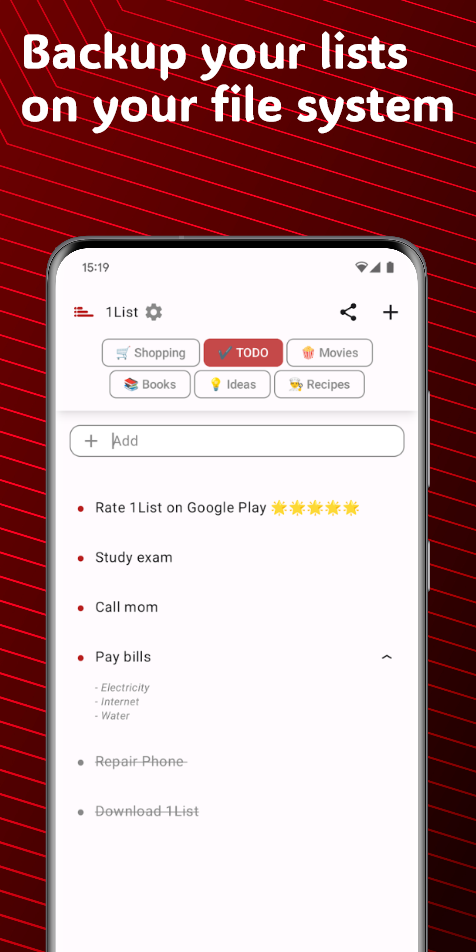

#  1List

1List is a simple app to manage several lists from only one screen.

## Download :

## Target platforms :

API 23 or later

## Features :

-   User friendly lists management and smooth navigation
-   Add, delete, edit items in your lists
-   Move items within your lists
-   Mark items as done or undone
-   Add comments on each items
-   Create an unlimited number of lists
-   Move, edit, remove your lists
-   ... more to come in the near future

## Screenshots :

    

## Donations :

[ Buy me a beer](https://www.paypal.com/donate/?business=Z32JPDRAJV2ZQ&no_recurring=0&item_name=1List+App&currency_code=EUR)
