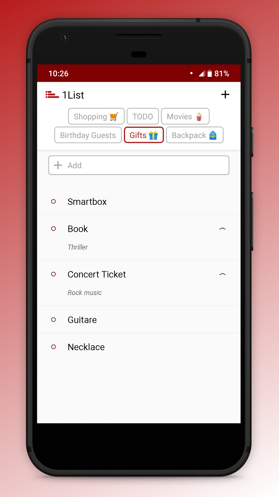

#  1List

1List is a simple app to manage several lists from only one screen.

## Download :

## Target platforms :

API 16 or later

## Features :

-   User friendly lists management and smooth navigation
-   Add, delete, edit items in your lists
-   Move items within your lists
-   Mark items as done or undone
-   Add comments on each items
-   Create an unlimited number of lists
-   Move, edit, remove your lists
-   ... more to come in the near future

## Screenshots :

     
